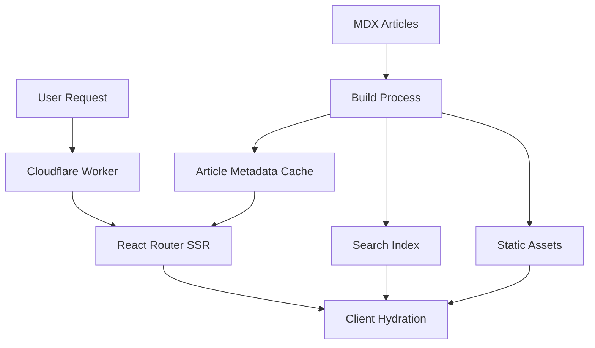

# Design Document

## Overview

The tech blog platform will be built as a static-first application using React Router v7 with server-side rendering capabilities on Cloudflare Workers. The architecture emphasizes build-time optimization, client-side performance, and modern web standards. Articles will be authored in MDX format and processed during build time to generate optimized static assets and search indices.

## Architecture

### High-Level Architecture



### File System Structure

```
/contents/blog/
├── article-slug-1/
│   ├── index.mdx
│   └── diagram.svg
├── article-slug-2/
│   ├── index.mdx
│   └── cover.jpg
└── ...

/contents/
├── apps.json                      # Apps section configuration
└── tags.json                      # Tag definitions with SVG icons

/app/
├── routes/
│   ├── blog/
│   │   ├── route.tsx              # Blog listing page
│   │   ├── article-card.tsx       # Article card component
│   │   └── search-box.tsx         # Search component
│   ├── blog.$slug/
│   │   ├── route.tsx              # Individual article page
│   │   ├── article-content.tsx    # Article content component
│   │   ├── reading-progress.tsx   # Reading progress indicator
│   │   ├── table-of-contents.tsx  # TOC component
│   │   ├── navigation-menu.tsx    # Navigation when TOC hidden
│   │   ├── related-articles.tsx   # Related articles component
│   │   └── markdown-components.tsx # Enhanced MDX components
│   ├── blog.tag.$tag/
│   │   ├── route.tsx              # Tag filtering page
│   │   └── tag-header.tsx         # Tag page header component
│   ├── apps/
│   │   ├── route.tsx              # Apps section page
│   │   └── app-card.tsx           # App card component
│   └── search/
│       ├── route.tsx              # Search results page (with deduplication)
│       └── search-results.tsx     # Enhanced search results component
├── lib/
│   ├── blog/
│   │   ├── mdx-processor.ts       # Enhanced MDX compilation with emoji support
│   │   ├── article-loader.ts      # Article metadata loading
│   │   ├── search-index.ts        # Enhanced search index with deduplication
│   │   └── related-articles.ts    # Related articles logic
│   └── utils/
└── components/
    ├── blog/
    │   ├── tag-badge.tsx          # Enhanced with SVG icons
    │   ├── theme-toggle.tsx
    │   ├── code-block.tsx         # Enhanced with copy/wrap buttons
    │   └── embedded-image.tsx     # Image embedding component
    ├── layout/
    │   ├── header.tsx             # Enhanced with custom logo
    │   └── navigation.tsx         # Mobile-responsive navigation
    ├── logo.tsx                   # Custom logo component
    └── ui/

/public/
├── blog-assets/                   # Generated from article images
├── search-index.json             # Enhanced search index
├── icons/
│   ├── tags/                      # SVG tag icons
│   │   ├── react.svg
│   │   ├── typescript.svg
│   │   └── ...
│   └── logo.svg                   # Custom blog logo
└── app-assets/                    # App thumbnails and assets
```

## Components and Interfaces

### Core Data Models

```typescript
interface Article {
  slug: string;
  title: string;
  description: string;
  publishedAt: Date;
  updatedAt: Date;
  tags: string[];
  emoji: string;
  content?: string; // Only loaded on article detail page
  readingTime: number; // Calculated during build
  relatedArticles?: ArticleMetadata[]; // Related articles based on tags
}

interface ArticleMetadata {
  slug: string;
  title: string;
  description: string;
  publishedAt: Date;
  updatedAt: Date;
  tags: string[];
  emoji: string;
  readingTime: number;
}

interface Tag {
  id: string;
  label: string;
  icon: string; // SVG file path
  description?: string;
}

interface App {
  id: string;
  title: string;
  description: string;
  thumbnail: string;
  url: string;
  technologies: string[];
  featured: boolean;
}

interface SearchIndex {
  articles: {
    slug: string;
    title: string;
    description: string;
    content: string;
    tags: string[];
  }[];
}

interface NavigationSection {
  id: string;
  title: string;
  level: number;
  anchor: string;
}
```

### Build-Time Processing

**Article Processor (`app/lib/blog/mdx-processor.ts`)**
- Discovers all MDX files in `/contents/blog/`
- Extracts and validates frontmatter
- Compiles MDX to React components
- Copies images to public directory
- Calculates reading time
- Generates article metadata cache

**Search Index Generator (`app/lib/blog/search-index.ts`)**
- Processes article content for search
- Creates FlexSearch-compatible index
- Strips MDX/HTML for plain text indexing
- Generates client-side search data

### Runtime Components

**Article Listing (`app/routes/blog/route.tsx`)**
- Loads cached article metadata
- Implements pagination
- Provides tag filtering
- Supports sorting options
- Co-located with `article-card.tsx` and `search-box.tsx` components

**Article Detail (`app/routes/blog.$slug/route.tsx`)**
- Loads individual article content
- Renders MDX with custom components
- Generates SEO meta tags
- Co-located with `article-content.tsx` and `reading-progress.tsx` components

**Tag Filtering (`app/routes/blog.tag.$tag/route.tsx`)**
- Displays articles filtered by specific tag
- Shows tag information and description
- Co-located with `tag-header.tsx` component

**Search Interface (`app/routes/search/route.tsx`)**
- Client-side search with FlexSearch and result deduplication
- Real-time search suggestions
- Keyboard navigation support
- Mobile-responsive search interface
- Co-located with enhanced `search-results.tsx` component

**Apps Section (`app/routes/apps/route.tsx`)**
- Displays web application portfolio
- Supports featured and regular app categories
- Responsive card layout for different screen sizes
- Co-located with `app-card.tsx` component

**Enhanced Article Components**
- **Code Block Enhancement**: Copy button and word wrap toggle functionality
- **Embedded Images**: Inline image support with progressive loading
- **Related Articles**: Tag-based article recommendations
- **Navigation Menu**: Alternative navigation when TOC is hidden
- **Mobile Responsiveness**: Optimized layouts for all screen sizes

## Data Models

### Article Frontmatter Schema

```yaml
title: "Building Modern Web Apps with React Router v7"
slug: "react-router-v7-guide"
publishedAt: "2024-01-15T10:00:00Z"
updatedAt: "2024-01-16T14:30:00Z"
tags: ["react", "routing", "web-development"]
description: "A comprehensive guide to building modern web applications using React Router v7 with server-side rendering."
emoji: "⚛️"
```

### Tags Configuration (`/contents/tags.json`)

```json
{
  "react": {
    "label": "React",
    "icon": "/icons/tags/react.svg",
    "description": "React library and ecosystem"
  },
  "cloudflare": {
    "label": "Cloudflare",
    "icon": "/icons/tags/cloudflare.svg",
    "description": "Cloudflare platform and services"
  },
  "typescript": {
    "label": "TypeScript",
    "icon": "/icons/tags/typescript.svg",
    "description": "TypeScript language and tooling"
  }
}
```

### Apps Configuration (`/contents/apps.json`)

```json
{
  "apps": [
    {
      "id": "task-manager",
      "title": "Task Manager Pro",
      "description": "A modern task management application built with React and TypeScript",
      "thumbnail": "/app-assets/task-manager/thumbnail.png",
      "url": "https://taskmanager.example.com",
      "technologies": ["react", "typescript", "tailwind"],
      "featured": true
    },
    {
      "id": "code-formatter",
      "title": "Code Formatter",
      "description": "Online code formatting tool supporting multiple languages",
      "thumbnail": "/app-assets/code-formatter/thumbnail.png",
      "url": "https://formatter.example.com",
      "technologies": ["javascript", "web-apis"],
      "featured": false
    }
  ]
}
```

### Generated Metadata Cache (`/public/blog-metadata.json`)

```json
{
  "articles": [
    {
      "slug": "react-router-v7-guide",
      "title": "Building Modern Web Apps with React Router v7",
      "description": "A comprehensive guide...",
      "publishedAt": "2024-01-15T10:00:00Z",
      "updatedAt": "2024-01-16T14:30:00Z",
      "tags": ["react", "routing", "web-development"],
      "emoji": "⚛️",
      "readingTime": 8
    }
  ],
  "generatedAt": "2024-01-20T12:00:00Z"
}
```

## Error Handling

### Build-Time Error Handling
- **Invalid Frontmatter**: Validate required fields and data types
- **Missing Images**: Check for referenced images and provide fallbacks
- **MDX Compilation Errors**: Provide detailed error messages with file locations
- **Duplicate Slugs**: Detect and prevent slug conflicts

### Runtime Error Handling
- **404 Articles**: Graceful handling of non-existent article slugs
- **Search Failures**: Fallback to basic filtering when search index fails
- **Image Loading**: Progressive loading with placeholder images
- **Theme Switching**: Persist theme preference and handle system changes

### Error Boundaries
```typescript
// Article-specific error boundary
export function ArticleErrorBoundary() {
  return (
    <div className="text-center py-12">
      <h2>Article Not Found</h2>
      <p>The requested article could not be loaded.</p>
      <Link to="/blog">← Back to Blog</Link>
    </div>
  );
}
```

## Testing Strategy

### Unit Testing
- **MDX Processing**: Test frontmatter parsing, content compilation
- **Search Functionality**: Test search index generation and querying
- **Utility Functions**: Test date formatting, reading time calculation
- **Component Logic**: Test article filtering, pagination, theme switching

### Integration Testing
- **Build Process**: Test complete article processing pipeline
- **Route Loading**: Test article and metadata loading in routes
- **Search Integration**: Test end-to-end search functionality
- **Theme Persistence**: Test theme switching across page navigation

### Performance Testing
- **Build Time**: Monitor article processing performance
- **Search Performance**: Test search response times with large datasets
- **Image Loading**: Test progressive loading and optimization
- **Bundle Size**: Monitor client-side JavaScript bundle size

### Accessibility Testing
- **Keyboard Navigation**: Test search, filtering, and article navigation
- **Screen Reader Support**: Test article content and navigation
- **Color Contrast**: Verify contrast ratios in both light and dark themes
- **Focus Management**: Test focus handling in search and navigation

## Implementation Phases

### Phase 1: Core Infrastructure
- Set up MDX processing pipeline
- Implement basic article loading and routing
- Create fundamental UI components

### Phase 2: Content Management
- Implement article listing and detail pages
- Add tag system and filtering
- Set up image handling and optimization

### Phase 3: Search and Discovery
- Integrate FlexSearch for client-side search
- Implement search UI and result highlighting
- Add advanced filtering options

### Phase 4: Polish and Optimization
- Implement dark/light theme switching
- Add SEO and OGP meta tag generation
- Optimize performance and bundle size
- Add accessibility improvements