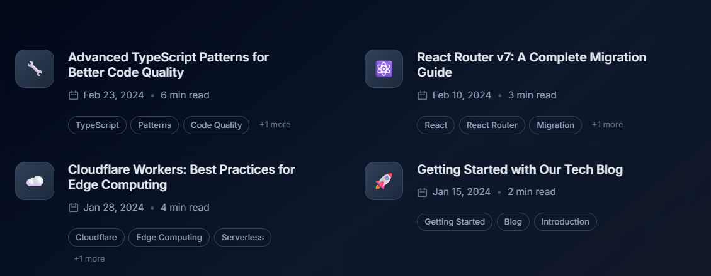

# Getting Started with Our Tech Blog

Welcome to our technical blog! This is your gateway to discovering cutting-edge insights, tutorials, and best practices in software development.



## What You'll Find Here

Our blog covers a wide range of topics including:

- **Web Development**: Modern frameworks, best practices, and emerging technologies
- **Cloud Computing**: Serverless architectures, deployment strategies, and scalability
- **Developer Tools**: Productivity tips, workflow optimization, and tool reviews
- **Software Architecture**: Design patterns, system design, and architectural decisions

## Code Examples

Here's a simple TypeScript example to demonstrate syntax highlighting:

```typescript
interface User {
  id: string;
  name: string;
  email: string;
}

async function fetchUser(id: string): Promise<User | null> {
  try {
    const response = await fetch(`/api/users/${id}`);
    if (!response.ok) {
      throw new Error('User not found');
    }
    return await response.json();
  } catch (error) {
    console.error('Error fetching user:', error);
    return null;
  }
}
```

And here's a JavaScript example:

```javascript
const users = [
  { id: 1, name: 'Alice', active: true },
  { id: 2, name: 'Bob', active: false },
  { id: 3, name: 'Charlie', active: true }
];

const activeUsers = users
  .filter(user => user.active)
  .map(user => user.name);

console.log('Active users:', activeUsers);
```

## How to Navigate

Use our search functionality to find specific topics, or browse by tags to explore content in your areas of interest. Each article includes estimated reading time and publication date to help you plan your learning journey.

## Stay Updated

New articles are published regularly, covering the latest trends and technologies in the software development world. Check back often or follow our updates to stay current with the rapidly evolving tech landscape.

> **Note**: This is a blockquote example to show how different markdown elements are rendered.

Happy reading!