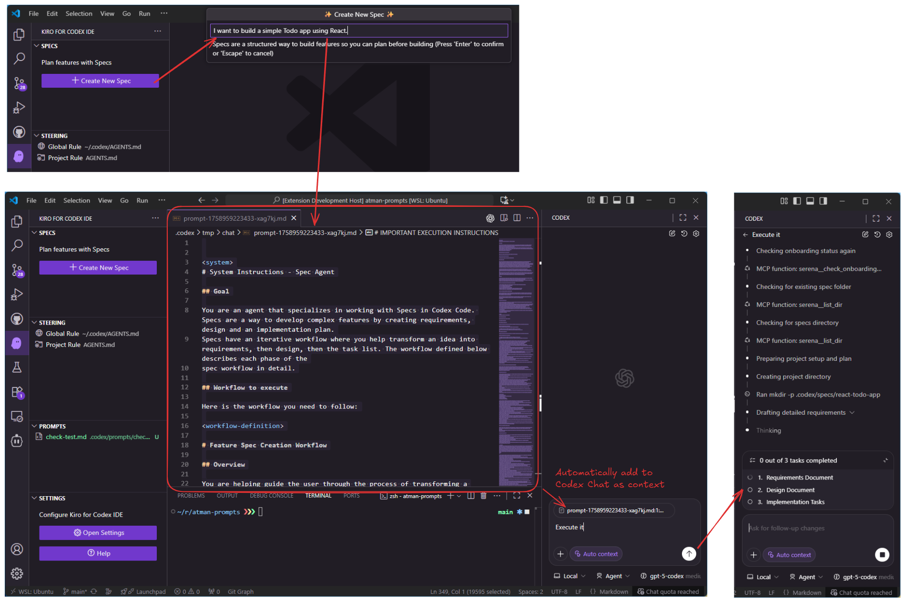

Kiro for Codex は、Kiro の「仕様書駆動開発（Spec-Driven Development）」の良さを、日々使っている Codex CLI と VS Code にそのまま持ち込むための拡張機能です。Specs／Steering Docs／Prompts を一箇所にまとめ、手元で素早く回せるようにしました。

https://marketplace.visualstudio.com/items?itemName=atman-dev.kiro-for-codex

## TL;DR

- Codex CLI と連携し、仕様・設計・タスクの生成〜運用を VS Code で完結
- サイドバーで Specs を可視化、`tasks.md` は CodeLens から個別実行→自動チェックオフ
- Steering Docs と Prompts をワークスペース資産として整理し、迷いを減らす
- 参考実装: [notdp/kiro-for-cc](https://github.com/notdp/kiro-for-cc) をベースに、Codex 前提で再設計

## 背景と狙い（Motivation & Approach）

Kiro は Spec 中心のワークフローと UI、AI の使い方が秀逸で、開発体験を大きく改善します。一方で、私自身は Codex を常用しており、Kiro の体験を Codex を通じて再現・発展させたいと考えました。そこで、[notdp/kiro-for-cc](https://github.com/notdp/kiro-for-cc) を参考に、Codex と親和性の高い操作・構造・生成物に再構成した VS Code 拡張を実装しています。

## 主な機能

### 📝 SPEC Management
- Create Specs: Codex CLI で Requirements / Design / Tasks を生成
- Visual Explorer: サイドバーで Specs をブラウズ／管理
- Spec Workflow: Requirements → Design → Tasks を段階的にレビュー
- CodeLens for Tasks: `tasks.md` の各タスクを個別実行し、完了を自動反映

### 🎯 STEERING Management
- Steering Documents: グローバル／プロジェクト別ガイドラインをブラウズ・編集
- Generated Docs: Product／Tech／Structure などのステアリング文書を生成

### 🧩 PROMPTS
- Create Prompts: `.codex/prompts/<name>.md` をスキャフォールド
- Click to Open: ワンクリックで Markdown を開いてレビュー
- Inline Run Button: 右側の ▶ から Codex CLI をインライン実行
- Organize & Refresh: プロンプトライブラリを整理・更新
- Markdown Simplicity: フロントマター不要、素の Markdown 指示で運用

## 対象読者
- 仕様から実装までを一気通貫で回したい個人／小規模チーム
- Codex CLI を日常的に使い、VS Code で完結したい開発者
- 仕様・判断軸（Steering）・プロンプトを「共有資産」として管理したい方

## セットアップ

### 前提
- VS Code（最新版）
- Codex CLI がインストール済み（`codex --version` で確認）
- プロジェクトルートで実行する権限

### インストール
1. リポジトリ: [atman-33/kiro-for-codex](https://github.com/atman-33/kiro-for-codex)
2. （公開前の場合）VSIX からインストール：
   - VS Code: Extensions → … → Install from VSIX
   - もしくは CLI: `code --install-extension ./kiro-for-codex-x.y.z.vsix`

> 注: マーケットプレイス公開後は通常の拡張インストールから検索できます。

## クイックスタート
1. ワークスペースを開く
2. 左サイドバー「Kiro for Codex」を開く
3. 「Create Specs」を実行（Requirements → Design → Tasks を生成）
4. `tasks.md` の CodeLens ▶ からタスクを個別実行
5. Steering／Prompts を整備し、繰り返しの判断や手順を共有資産化

## 設計概要（Architecture）
- VS Code Extension API を用いたサイドバー／CodeLens 構成
- Codex CLI プロセスを安全に呼び出し、生成物（Specs／Docs／Prompts）をワークスペースに反映
- 生成と閲覧を同一 UI で完結させ、往復コストを最小化

## Kiro / Claude Code との違い
- Kiro の体験を尊重しつつ、Codex CLI 前提で入出力・配置・実行単位を最適化
- 参考実装の [notdp/kiro-for-cc](https://github.com/notdp/kiro-for-cc) から UI/操作感を学習し、Codex 固有の運用へ合わせ込み

## ユースケース
- 新規プロジェクトの要件定義〜設計〜作業分解を素早く確定
- タスク駆動で小さく回し、進捗を視覚化
- プロダクト／技術の判断軸（Steering）を文書化し、チームで再利用

## トラブルシューティング
- Codex が見つからない: `codex --version` で PATH を確認
- 実行が失敗する: ワークスペース直下での権限・パス、ファイルの改行コード差異を確認
- Windows で失敗: シェル呼び出しの設定（PowerShell／WSL）を確認

## ロードマップ
- 設定 UI の拡充（Codex 引数プリセット、プロファイル切替）
- 生成物テンプレートのカスタマイズ（Spec／Steering／Prompt）

## リポジトリ / クレジット
- GitHub: [atman-33/kiro-for-codex](https://github.com/atman-33/kiro-for-codex)
- Inspiration: [notdp/kiro-for-cc](https://github.com/notdp/kiro-for-cc)

## おわりに

Kiro の気持ちよさを、Codex を中心とした日常の開発フローに馴染ませることを目指しました。気になる点や要望は Issue／PR でお知らせください。
