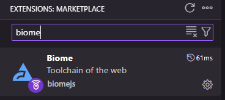
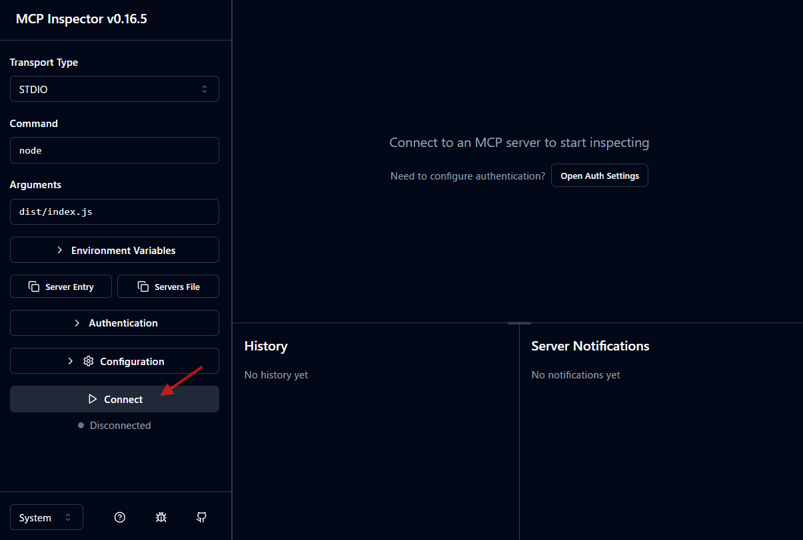

MCP (Model Context Protocol) サーバーを TypeScript で開発してみたい、でも環境構築って何から手をつければいいんだろう…？ そんな風に思ったことはありませんか？

この記事では、新しいプロジェクトを立ち上げ、開発をスムーズに進めるための「TypeScript ミニマルセットアップ」を、順を追ってご紹介します。Linter/Formatter には Biome を、コード品質を保つ仕組みとして Husky を採用し、最終的には npm パッケージとして公開するまでの流れを解説します。

実際に開発したリポジトリは [https://github.com/atman-33/mcp-ts-minimal](https://github.com/atman-33/mcp-ts-minimal) で公開していますので、詳細はこちらも参考にしてください。

https://github.com/atman-33/mcp-ts-minimal/

## プロジェクトの準備

まずは、開発の土台となるプロジェクトの器を用意しましょう。

### 1. プロジェクトフォルダの作成と Git の初期化

はじめに、プロジェクト用のフォルダを作成し、`git init` でバージョン管理を開始します。

```sh
mkdir mcp-ts-minimal
cd mcp-ts-minimal
git init
```

次に、`node_modules` やビルド成果物である `dist` フォルダを Git の管理対象から外すため、`.gitignore` ファイルを作成します。

```.gitignore
node_modules
dist
```

### 2. npm プロジェクトの初期化

`npm init` を実行して `package.json` を作成します。いくつか質問されますが、後から修正できるので、まずはデフォルトのままでも大丈夫です。

```sh
npm init
```

### 3. TypeScript の導入と設定

TypeScript を開発依存パッケージとしてインストールし、`tsconfig.json` を生成します。

```sh
npm i -D typescript
npx tsc --init
```

生成された `tsconfig.json` を、以下のように編集します。`outDir` (コンパイル後の出力先) と `rootDir` (ソースコードの場所) を明示的に指定するのがポイントです。

`tsconfig.json`

```json
{
  "compilerOptions": {
    "target": "ES2022",
    "strict": true,
    "declaration": true,
    "declarationMap": true,
    "sourceMap": true,
    "esModuleInterop": true,
    "skipLibCheck": true,
    "forceConsistentCasingInFileNames": true,
    "resolveJsonModule": true,
    "outDir": "./dist",
    "rootDir": "src",
    "moduleResolution": "NodeNext",
    "module": "NodeNext"
  },
  "exclude": [
    "node_modules"
  ],
  "include": [
    "./src/**/*.ts"
  ]
}
```

## Biome でコードを綺麗に保つ

[Biome](https://biomejs.dev/) は、コードのフォーマットと静的解析を高速に行ってくれる、非常に便利なツールです。

### 1. Biome のインストールと設定

Biome をインストールし、設定ファイルを生成します。

```sh
npm install --save-dev --save-exact @biomejs/biome
npx @biomejs/biome init
```

`biome.json` が生成されたら、以下のように設定しましょう。TypeScript ファイルを対象に、フォーマットとリンターを有効にしています。

`biome.json`

```json
{
	"$schema": "https://biomejs.dev/schemas/2.x.x/schema.json",
	"vcs": {
		"enabled": false,
		"clientKind": "git",
		"useIgnoreFile": false
	},
	"files": {
		"includes": [
			"src/**/*.ts"
		],
		"ignoreUnknown": false
	},
	"formatter": {
		"enabled": true,
		"indentStyle": "space"
	},
	"linter": {
		"enabled": true,
		"rules": {
			"recommended": true
		}
	},
	"javascript": {
		"formatter": {
			"quoteStyle": "single",
			"semicolons":"always"
		}
	},
	"assist": {
		"enabled": true,
		"actions": {
			"source": {
				"organizeImports": "on"
			}
		}
	}
}
```

### 2. VS Code との連携

VS Code をお使いなら、Biome の拡張機能をインストールし、設定ファイル (`.vscode/settings.json`) に以下の設定を追加することで、保存時に自動でフォーマットや import の整理が実行されるようになります。

拡張機能をインストール：



`.vscode/settings.json`

```json
{
  "editor.formatOnSave": true,
  "[javascript]": {
    "editor.defaultFormatter": "biomejs.biome"
  },
  "[javascriptreact]": {
    "editor.defaultFormatter": "biomejs.biome"
  },
  "[typescript]": {
    "editor.defaultFormatter": "biomejs.biome"
  },
  "[typescriptreact]": {
    "editor.defaultFormatter": "biomejs.biome"
  },
  "editor.codeActionsOnSave": {
    "quickfix.biome": "explicit",
    "source.fixAll.ts": "explicit",
    "source.sortImports": "never",
    "source.organizeImports": "never",
    "source.organizeImports.biome": "explicit"
  }
}
```

## Husky でコミット前のチェックを自動化

[Husky](https://typicode.github.io/husky/) は、Git のフックを簡単に利用できるようにするツールです。これを使って、コミット前に Biome のチェックを強制し、コードの品質を保ちましょう。

### 1. Husky のインストールと設定

Husky をインストールし、初期設定を行います。

```sh
npm i -D husky
npx husky init
```

これにより、`.husky` フォルダが作成されます。次に、コミット前に実行したい処理を `.husky/pre-commit` ファイルに記述します。

`.husky/pre-commit`

```text
npx biome check --staged --fix --no-errors-on-unmatched
git update-index --again
```

これで、`git commit` を実行するたびに、ステージングされたファイルに対して Biome のチェックと自動修正が実行されるようになりました。

## MCP サーバーを実装する

いよいよ、MCP サーバーの本体を実装します。

### 1. 必要なパッケージのインストール

MCP の SDK と、入力値のバリデーションに使う Zod をインストールします。

```sh
npm i @modelcontextprotocol/sdk zod zod-to-json-schema
```

開発用に、`ts-node` と `@types/node` も入れておきましょう。

```sh
npm i -D ts-node @types/node
```

### 2. ミニマルな MCP サーバーのコード

`src/index.ts` を作成し、以下のような最小構成の MCP サーバーを実装します。このサーバーは、`hello` と `echo` という 2 つのシンプルなツールを提供します。

`src/index.ts`

```ts
#!/usr/bin/env node

import { Server } from '@modelcontextprotocol/sdk/server/index.js';
import { StdioServerTransport } from '@modelcontextprotocol/sdk/server/stdio.js';
import {
  CallToolRequestSchema,
  ListToolsRequestSchema,
} from '@modelcontextprotocol/sdk/types.js';
import { z } from 'zod';
import zodToJsonSchema from 'zod-to-json-schema';

// `echo` ツールの入力スキーマ
const EchoToolInputSchema = z.object({
  message: z.string(),
});

// MCP サーバーのインスタンスを作成
const server = new Server(
  {
    name: 'mcp-minimal',
    version: '1.0.0',
  },
  {
    capabilities: {
      tools: {},
    },
  },
);

// `CallTool` リクエストのハンドラ
server.setRequestHandler(CallToolRequestSchema, async (request) => {
  const { name, arguments: args } = request.params;

  switch (name) {
    case 'hello':
      return {
        content: [{ type: 'text', text: 'Hello from MCP server' }],
      };

    case 'echo': {
      const parsed = EchoToolInputSchema.safeParse(args);
      if (!parsed.success) {
        return {
          content: [
            { type: 'text', text: `Invalid arguments: ${parsed.error}` },
          ],
          isError: true,
        };
      }

      return {
        content: [{ type: 'text', text: `Echo: ${parsed.data.message}` }],
      };
    }

    default:
      return {
        content: [{ type: 'text', text: `Unknown tool: ${name}` }],
        isError: true,
      };
  }
});

// `ListTools` リクエストのハンドラ
server.setRequestHandler(ListToolsRequestSchema, async () => {
  return {
    tools: [
      {
        name: 'hello',
        description: 'Responds with a greeting message',
        inputSchema: { type: 'object', properties: {} },
      },
      {
        name: 'echo',
        description: 'Echoes the provided message',
        inputSchema: zodToJsonSchema(EchoToolInputSchema),
      },
    ],
  };
});

// サーバーを起動
async function runServer() {
  const transport = new StdioServerTransport();
  await server.connect(transport);
  console.error('MCP Minimal Server running on stdio');
}

runServer().catch((error) => {
  console.error('Fatal error running server:', error);
  process.exit(1);
});
```

### 3. `package.json` のスクリプトを整備

開発やビルド、品質チェックを簡単に行えるように、`package.json` の `scripts` を充実させます。

```json:package.json
{
  "name": "mcp-ts-minimal",
  "scripts": {
    "build": "tsc",
    "dev": "ts-node src/index.ts",
    "start": "node dist/index.js",
    "lint": "biome lint src/",
    "lint:fix": "biome lint --write src/",
    "format": "biome format --write src/",
    "check": "biome check --write src/",
    "typecheck": "tsc --noEmit",
    "quality": "npm run typecheck && npm run check",
    "prepare": "husky"
  }
}
```

## 動作確認

[MCP Inspector](https://github.com/model-context-protocol/inspector) を使って、作成したサーバーが正しく動作するか確認しましょう。

まず、`npm run build` でソースコードをコンパイルします。その後、以下のコマンドで MCP Inspector を起動します。

```sh
npx @modelcontextprotocol/inspector node dist/index.js
```

MCP Inspector が起動したら、「Connect」ボタンでサーバーに接続し、「List Tools」でツールが一覧表示されるか、各ツールが意図通りに動作するかを確認します。

サーバー接続：



ツール一覧表示：


動作確認：


## npm パッケージとして公開する

最後に、作成した MCP サーバーを npm パッケージとして公開し、誰でも `npx` コマンドで使えるようにします。

### 1. 公開設定

ルートディレクトリに `.npmrc` ファイルを作成し、`access=public` と記述することで、パッケージが public に公開されるようになります。

`.npmrc`

```text
access=public
```

### 2. `package.json` の最終調整

`npx` コマンドで実行できるように `bin` フィールドを追加し、`description` や `files` (公開するファイル) を設定します。

`package.json`

```json
{
  "name": "mcp-ts-minimal",
  "version": "0.1.0",
  "description": "A minimal MCP server example with hello and echo tools",
  "bin": {
    "mcp-ts-minimal": "dist/index.js"
  },
  "files": [
    "dist",
    "README.md",
    "package.json"
  ]
}
```

### 3. npm へ公開

準備が整ったら、ビルドして `npm publish` を実行します。事前に npm のアカウントを作成し、ログインしておく必要があります。

```sh
npm run build
npm publish
```

これで、あなたの MCP サーバーが世界中に公開されました！

## まとめ

本記事では、TypeScript を使った MCP サーバー開発の第一歩として、プロジェクトのセットアップから、Biome や Husky を用いた開発環境の整備、そして npm での公開までの一連の流れを解説しました。

このミニマルな環境をベースに、ぜひあなた独自のツールや機能を持った MCP サーバー開発に挑戦してみてください。