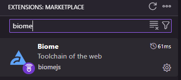
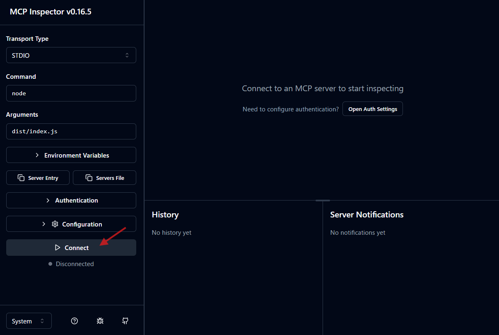
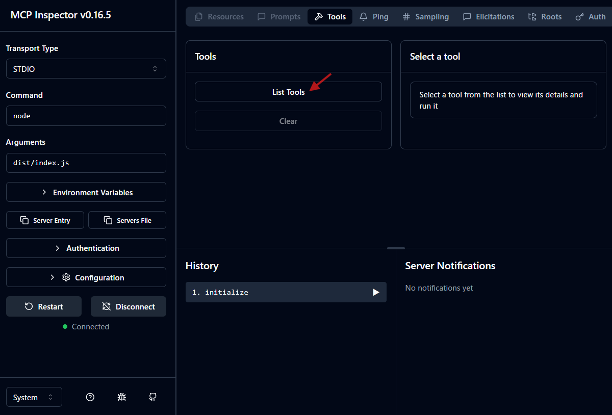
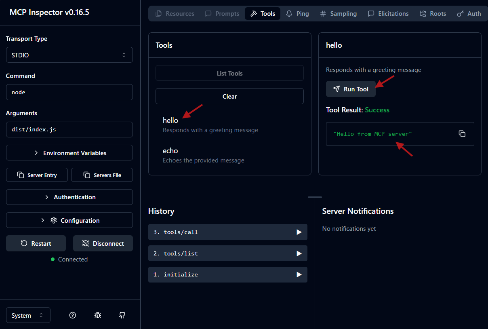

Have you ever wanted to develop an MCP (Model Context Protocol) server with TypeScript, but wondered where to start with the environment setup?

This article provides a step-by-step guide to a "minimal TypeScript setup" for launching a new project and proceeding smoothly with development. We will use Biome for the Linter/Formatter, Husky as a mechanism to maintain code quality, and explain the flow up to publishing as an npm package in the end.

The repository I actually developed is available at [https://github.com/atman-33/mcp-ts-minimal](https://github.com/atman-33/mcp-ts-minimal), so please refer to this for details.

https://github.com/atman-33/mcp-ts-minimal/

## Project Preparation

First, let's prepare the project container that will be the foundation for development.

### 1. Create a project folder and initialize Git

First, create a folder for the project and start version control with `git init`.

```sh
mkdir mcp-ts-minimal
cd mcp-ts-minimal
git init
```

Next, create a `.gitignore` file to exclude the `node_modules` and the build artifact `dist` folder from Git's management.

```.gitignore
node_modules
dist
```

### 2. Initialize npm project

Execute `npm init` to create a `package.json` file. You will be asked a few questions, but you can modify them later, so it's okay to leave them as default for now.

```sh
npm init
```

### 3. Introduce and configure TypeScript

Install TypeScript as a development dependency and generate `tsconfig.json`.

```sh
npm i -D typescript
npx tsc --init
```

Edit the generated `tsconfig.json` as follows. The point is to explicitly specify `outDir` (output destination after compilation) and `rootDir` (location of source code).

`tsconfig.json`

```json
{
  "compilerOptions": {
    "target": "ES2022",
    "strict": true,
    "declaration": true,
    "declarationMap": true,
    "sourceMap": true,
    "esModuleInterop": true,
    "skipLibCheck": true,
    "forceConsistentCasingInFileNames": true,
    "resolveJsonModule": true,
    "outDir": "./dist",
    "rootDir": "src",
    "moduleResolution": "NodeNext",
    "module": "NodeNext"
  },
  "exclude": [
    "node_modules"
  ],
  "include": [
    "./src/**/*.ts"
  ]
}
```

## Keep your code clean with Biome

[Biome](https://biomejs.dev/) is a very useful tool that performs code formatting and static analysis at high speed.

### 1. Install and configure Biome

Install Biome and generate a configuration file.

```sh
npm install --save-dev --save-exact @biomejs/biome
npx @biomejs/biome init
```

Once `biome.json` is generated, let's configure it as follows. We are enabling the formatter and linter for TypeScript files.

`biome.json`

```json
{
	"$schema": "https://biomejs.dev/schemas/2.x.x/schema.json",
	"vcs": {
		"enabled": false,
		"clientKind": "git",
		"useIgnoreFile": false
	},
	"files": {
		"includes": [
			"src/**/*.ts"
		],
		"ignoreUnknown": false
	},
	"formatter": {
		"enabled": true,
		"indentStyle": "space"
	},
	"linter": {
		"enabled": true,
		"rules": {
			"recommended": true
		}
	},
	"javascript": {
		"formatter": {
			"quoteStyle": "single",
			"semicolons":"always"
		}
	},
	"assist": {
		"enabled": true,
		"actions": {
			"source": {
				"organizeImports": "on"
			}
		}
	}
}
```

### 2. Integration with VS Code

If you are using VS Code, you can install the Biome extension and add the following settings to your configuration file (`.vscode/settings.json`) to automatically format and organize imports on save.

Install the extension:



`.vscode/settings.json`

```json
{
  "editor.formatOnSave": true,
  "[javascript]": {
    "editor.defaultFormatter": "biomejs.biome"
  },
  "[javascriptreact]": {
    "editor.defaultFormatter": "biomejs.biome"
  },
  "[typescript]": {
    "editor.defaultFormatter": "biomejs.biome"
  },
  "[typescriptreact]": {
    "editor.defaultFormatter": "biomejs.biome"
  },
  "editor.codeActionsOnSave": {
    "quickfix.biome": "explicit",
    "source.fixAll.ts": "explicit",
    "source.sortImports": "never",
    "source.organizeImports": "never",
    "source.organizeImports.biome": "explicit"
  }
}
```

## Automate pre-commit checks with Husky

[Husky](https://typicode.github.io/husky/) is a tool that makes it easy to use Git hooks. Let's use this to enforce Biome checks before committing and maintain code quality.

### 1. Install and configure Husky

Install Husky and perform initial setup.

```sh
npm i -D husky
npx husky init
```

This will create a `.husky` folder. Next, describe the process you want to execute before committing in the `.husky/pre-commit` file.

`.husky/pre-commit`

```text
npx biome check --staged --fix --no-errors-on-unmatched
git update-index --again
```

Now, every time you run `git commit`, Biome's check and auto-correction will be executed on the staged files.

## Implement the MCP server

Finally, let's implement the main body of the MCP server.

### 1. Install necessary packages

Install the MCP SDK and Zod, which is used for input value validation.

```sh
npm i @modelcontextprotocol/sdk zod zod-to-json-schema
```

For development, let's also install `ts-node` and `@types/node`.

```sh
npm i -D ts-node @types/node
```

### 2. Minimal MCP server code

Create `src/index.ts` and implement a minimal MCP server like the one below. This server provides two simple tools: `hello` and `echo`.

`src/index.ts`

```ts
#!/usr/bin/env node

import { Server } from '@modelcontextprotocol/sdk/server/index.js';
import { StdioServerTransport } from '@modelcontextprotocol/sdk/server/stdio.js';
import {
  CallToolRequestSchema,
  ListToolsRequestSchema,
} from '@modelcontextprotocol/sdk/types.js';
import { z } from 'zod';
import zodToJsonSchema from 'zod-to-json-schema';

// Input schema for the `echo` tool
const HelloToolInputSchema = z.object({
  message: z.string(),
});

// Create an instance of the MCP server
const server = new Server(
  {
    name: 'mcp-minimal',
    version: '1.0.0',
  },
  {
    capabilities: {
      tools: {},
    },
  },
);

// Handler for `CallTool` requests
server.setRequestHandler(CallToolRequestSchema, async (request) => {
  const { name, arguments: args } = request.params;

  switch (name) {
    case 'hello':
      return {
        content: [{ type: 'text', text: 'Hello from MCP server' }],
      };

    case 'echo': {
      const parsed = HelloToolInputSchema.safeParse(args);
      if (!parsed.success) {
        return {
          content: [
            { type: 'text', text: `Invalid arguments: ${parsed.error}` },
          ],
          isError: true,
        };
      }

      return {
        content: [{ type: 'text', text: `Echo: ${parsed.data.message}` }],
      };
    }

    default:
      return {
        content: [{ type: 'text', text: `Unknown tool: ${name}` }],
        isError: true,
      };
  }
});

// Handler for `ListTools` requests
server.setRequestHandler(ListToolsRequestSchema, async () => {
  return {
    tools: [
      {
        name: 'hello',
        description: 'Responds with a greeting message',
        inputSchema: { type: 'object', properties: {} },
      },
      {
        name: 'echo',
        description: 'Echoes the provided message',
        inputSchema: zodToJsonSchema(HelloToolInputSchema),
      },
    ],
  };
});

// Start the server
async function runServer() {
  const transport = new StdioServerTransport();
  await server.connect(transport);
  console.error('MCP Minimal Server running on stdio');
}

runServer().catch((error) => {
  console.error('Fatal error running server:', error);
  process.exit(1);
});
```

### 3. Set up scripts in `package.json`

Let's enrich the `scripts` in `package.json` to make development, building, and quality checks easy.

`package.json`

```json
{
  "name": "mcp-ts-minimal",
  "scripts": {
    "build": "tsc",
    "dev": "ts-node src/index.ts",
    "start": "node dist/index.js",
    "lint": "biome lint src/",
    "lint:fix": "biome lint --write src/",
    "format": "biome format --write src/",
    "check": "biome check --write src/",
    "typecheck": "tsc --noEmit",
    "quality": "npm run typecheck && npm run check",
    "prepare": "husky"
  }
}
```

## Operation Check

Let's use [MCP Inspector](https://github.com/model-context-protocol/inspector) to check if the created server works correctly.

First, compile the source code with `npm run build`. Then, start MCP Inspector with the following command.

```sh
npx @modelcontextprotocol/inspector node dist/index.js
```

Once MCP Inspector starts, connect to the server with the "Connect" button, and check if the tools are listed with "List Tools" and if each tool works as intended.

Server connection:



List tools:



Check operation:



## Publish as an npm package

Finally, let's publish the created MCP server as an npm package so that anyone can use it with the `npx` command.

### 1. Publication settings

Create a `.npmrc` file in the root directory and write `access=public` to make the package public.

`.npmrc`

```text
access=public
```

### 2. Final adjustments to `package.json`

Add a `bin` field so that it can be executed with the `npx` command, and set the `description` and `files` (files to be published).

`package.json`

```json
{
  "name": "mcp-ts-minimal",
  "version": "0.1.0",
  "description": "A minimal MCP server example with hello and echo tools",
  "bin": {
    "mcp-ts-minimal": "dist/index.js"
  },
  "files": [
    "dist",
    "README.md",
    "package.json"
  ]
}
```

### 3. Publish to npm

Once you are ready, build and run `npm publish`. You need to create an npm account and log in in advance.

```sh
npm run build
npm publish
```

Now, your MCP server has been released to the world!

## Summary

This article explained the first step of MCP server development using TypeScript, from project setup to development environment maintenance using Biome and Husky, and the flow up to publication on npm.

Based on this minimal environment, please try to develop your own MCP server with your own tools and functions.