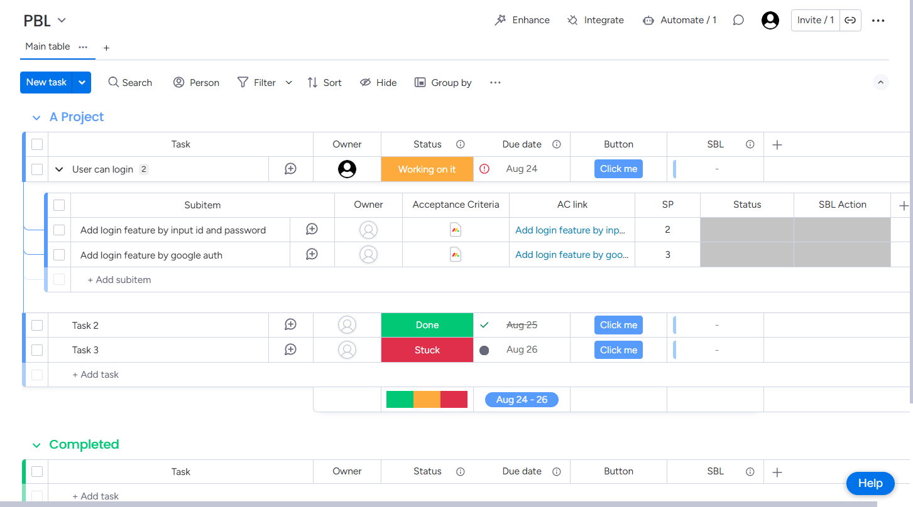
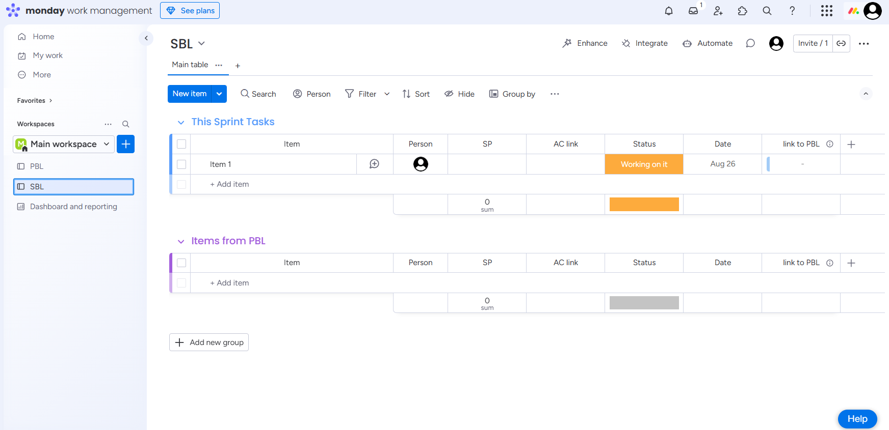
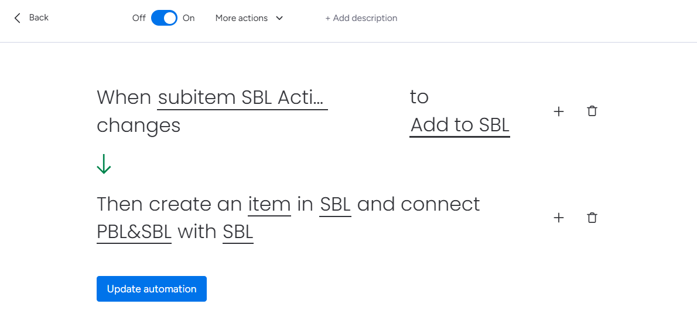

monday.comでプロジェクト管理を行う際、PBL（Product Backlog）ボードのサブアイテムをSBL（Sprint Backlog）ボードに手動でコピーする作業は時間がかかり、ミスも発生しやすい作業です。

この記事では、monday.comの標準Automateを使用して、PBLボードのサブアイテムからSBLボードへのアイテム作成を自動化する方法を詳しく解説します。

## モチベーション

PBLボードのサブアイテムであるPBI（Product Backlog Item）をSBL（Sprint Backlog）に登録する際、標準ではボタンが用意されていないため、手動でコピーする手間が発生していました。

サブアイテムに直接ボタンがあれば自動化できますが、monday.comの標準機能では提供されていません。そこで、monday.comの標準Automateを使用してこの作業を自動化することにしました。

## アプローチ

今回のアプローチでは、monday.comの標準Automateを使用して自動化を実現します。具体的には以下の手順で進めます：

1. PBLボードの準備
2. SBLボードの準備  
3. Automateの設定
4.動作確認

## PBLボードの準備

まず、PBLボードにサブアイテムに分割したPBIを登録し、必要なカラムを追加します。

### 必要なカラムの追加

- **SP**：ストーリーポイントを記録するカラム
- **Acceptance Criteria**：受け入れ条件を記録するカラム
- **AC link**：Acceptance Criteriaページへのリンクを保存するカラム

### 重要なポイント

monday docタイプの「Acceptance Criteria」は、自動化で他ボードにアイテム作成する際にコピー（同様のデータを作成）できません。そのため、「AC link」カラムを作成し、Acceptance Criteriaのページのリンクを保存しておきます。

## SBLボードの準備

次に、SBLボードにPBLボードからのデータを受け取るためのカラムを準備します。

### 必要なカラムの追加

- **SP**：PBLボードからストーリーポイントを受け取るカラム
- **AC link**：PBLボードからAcceptance Criteriaのリンクを受け取るカラム

## Automateの設定

PBLボードにAutomateを登録して、サブアイテムからSBLボードへのアイテム作成を自動化します。

### トリガーの設定

サブアイテムの「SBL Action」ステータスが「Add to SBL」に変更された時に実行されるように設定します。

### アクションの設定

SBLボードにアイテムを作成する際、以下の情報を設定します：

- **Subitem Name**：サブアイテムの名前
- **SP**：ストーリーポイント
- **AC link**：Acceptance Criteriaへのリンク

## 動作確認

設定が完了したら、実際に動作するかテストしてみます。

### テスト手順

1. PBLボードの「SBL Action」カラムのステータスを「Add to SBL」に変更します

2. SBLボードに、PBLのデータを元にしたアイテムが自動生成されていることを確認します

## メリットと効果

この自動化により、以下のメリットが得られます：

### 作業効率の向上
- 手動コピーの時間を大幅に削減
- ヒューマンエラーの防止
- 一貫性のあるデータ転送

### データの整合性
- 必要な情報が確実に転送される
- フォーマットの統一
- リンク情報の保持

### チーム生産性の向上
- スプリント計画の効率化
- より多くの時間を実際の開発作業に充てられる
- プロセスの標準化

## 注意点とベストプラクティス

### データ構造の統一
PBLボードとSBLボードで同じカラム名と型を使用することで、データの整合性を保てます。

### リンク情報の管理
monday docの制限により、直接的なコピーができない場合は、リンクを活用することで情報の連携を実現できます。

### テストの重要性
本格運用前に、必ずテスト環境で動作確認を行い、期待通りの結果が得られることを確認しましょう。

## まとめ

monday.comの標準Automateを使用することで、PBLからSBLへのアイテム作成を効率的に自動化できました。

この方法により、手動作業の削減とデータの整合性確保を同時に実現し、チーム全体の生産性向上に貢献できます。

monday.comを使用したプロジェクト管理において、このような自動化は非常に有効です。ぜひ皆さんのプロジェクトでも活用してみてください。

> **ヒント**: 他のボード間でも同様の自動化が可能です。チームのワークフローに合わせて、さまざまな自動化パターンを検討してみましょう。