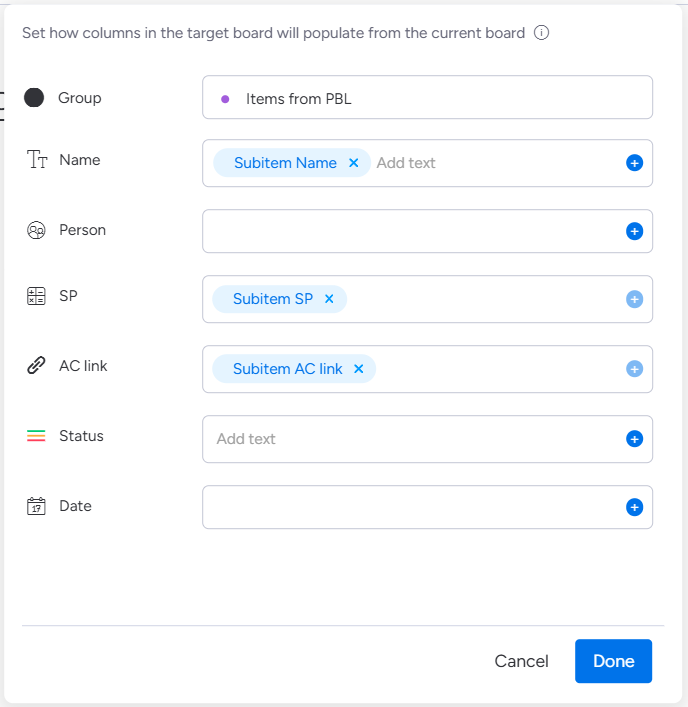

スプリント計画の度に、PBLボードからSBLボードへアイテムをコピーする作業にうんざりしていませんか？私もその一人でした。

毎回同じ作業を繰り返すたびに「これ、絶対に自動化できるはず...」と思いながらも、なかなか手をつけられずにいました。でも、ついに重い腰を上げて monday.com の標準機能だけで解決する方法を見つけたんです。

今回は、その実体験をもとに、PBLからSBLへの面倒なコピー作業を完全自動化する方法をお伝えします。

## なぜこの自動化が必要だったのか

正直に言うと、最初は「まあ、コピペくらい大した作業じゃないし...」と思っていました。でも、チームが成長するにつれて、この「ちょっとした作業」が積み重なって、気づけばスプリント計画に時間がかかるようになっていたんです。

特に困ったのが、サブアイテムには標準でSBLに移すボタンがないこと。「なんで親アイテムにはあるのに、サブアイテムにはないの？」って、monday.comに文句を言いたくなりました（笑）。

でも愚痴を言っても始まらないので、標準のAutomateで何とかできないか試行錯誤してみることにしたんです。

## 解決への道のり

いくつかのアプローチを検討した結果、monday.comの標準Automateが一番現実的でした。外部ツールを使う方法もありましたが、「シンプルが一番」という信念のもと、標準機能だけで完結させることにしました。

実際にやってみると、思ったより簡単でした：

1. PBLボードに必要なカラムを追加
2. SBLボードも同様に準備
3. Automateでトリガーとアクションを設定
4. ドキドキしながら動作テスト

## PBLボードの設定：意外な落とし穴があった

最初にPBLボードを準備するのですが、ここで早速つまずきました。

### 追加したカラム

- **SP**：ストーリーポイント（これは普通）
- **Acceptance Criteria**：受け入れ条件（monday docで作成）
- **AC link**：これが重要！後で説明します

### ここで大きな発見

実は、monday docタイプの「Acceptance Criteria」って、自動化でコピーできないんです。これ、知らなくて最初にハマりました。

そこで思いついたのが「AC link」カラムです。Acceptance Criteriaのページリンクを保存しておけば、少なくとも参照はできますからね。

完璧じゃないけど、実用的な妥協案でした。

## SBLボードの準備：シンプルが一番

SBLボードの設定は、PBLボードの経験があったのでスムーズでした。基本的には「受け取る側」の準備をするだけです。

### 追加したカラム

- **SP**：ストーリーポイントを受け取る用
- **AC link**：Acceptance Criteriaのリンクを受け取る用

PBLボードと同じ名前にしておくのがコツです。後でAutomateの設定が楽になります。

## Automateの設定：ここが本番

### トリガーの設定

「SBL Action」というステータスカラムを作って、これが「Add to SBL」に変更されたらAutomateが動くように設定しました。

このトリガー方式にしたのは、「間違って全部のアイテムが移動しちゃった！」なんて事故を防ぐためです。明示的に「移動させたい」と意思表示したものだけが対象になります。

### アクションの設定

SBLボードに新しいアイテムを作る時に、こんな情報を引き継ぎます：

- **アイテム名**：サブアイテムの名前をそのまま
- **SP**：ストーリーポイントの値
- **AC link**：Acceptance Criteriaへのリンク

## 動作確認

設定が終わったら、いよいよ「動くかどうか」の瞬間です。

### テスト

1. PBLボードで「SBL Action」を「Add to SBL」に変更

2. SBLボードを確認すると...おお！ちゃんとアイテムが作られてる！

## 実際に使ってみて感じた効果

この自動化を導入してから、スプリント計画が劇的に楽になりました。数字で表すのは難しいですが、体感的には：

### ミスがなくなった
手動コピーの時は、たまにストーリーポイントを間違えたり、リンクを貼り忘れたりしていました。今はそういう心配が一切ありません。

## 実際にやってみて学んだコツ

### カラム名は絶対に統一する
これ、最初に適当な名前をつけて後で後悔しました。PBLとSBLで同じ名前にしておかないと、Automateの設定で混乱します。

### monday docの制限は受け入れる
最初は「なんでコピーできないの！」って怒ってましたが、リンクで代用する方法を見つけてからは「まあ、これでも十分かな」って思えるようになりました。

## 振り返ってみて

この自動化に取り組んで本当に良かったと思います。最初は「面倒だな...」って思っていた作業が、今では「ボタン一つで終わり」になったんですから。

もしあなたも同じような悩みを抱えているなら、ぜひ試してみてください。monday.comの標準機能だけでも、意外といろんなことができるものです。

最初は完璧を目指さず、「とりあえず動けばOK」くらいの気持ちで始めてみてください。きっと、思っているより簡単にできますよ。

> **最後に一言**: この自動化パターンは他のボード間でも応用できます。「これも自動化できそうだな」って思ったら、どんどん試してみてください。monday.comライフがもっと楽しくなりますよ！