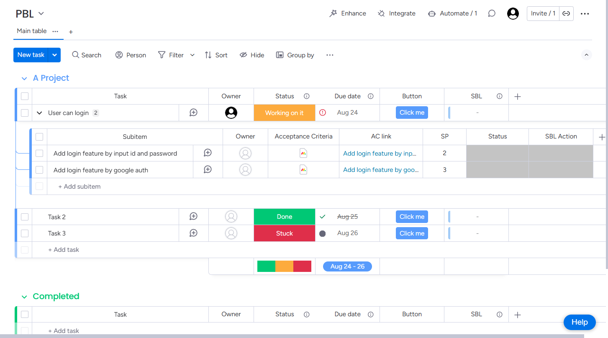
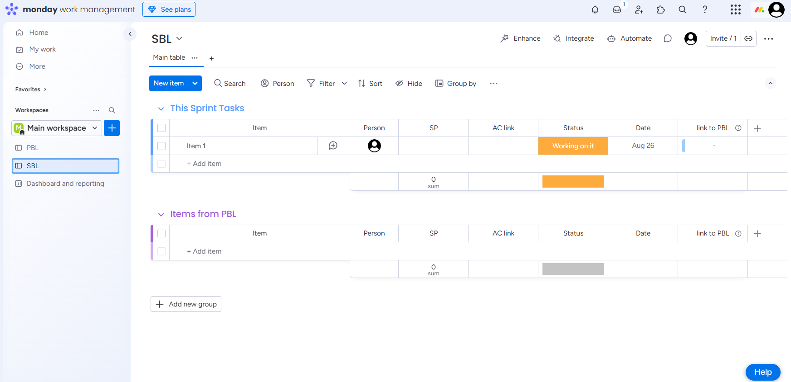
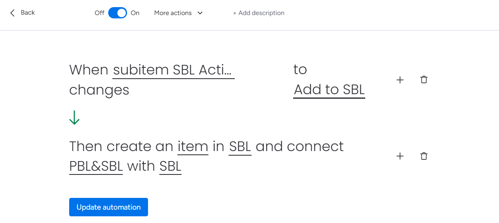
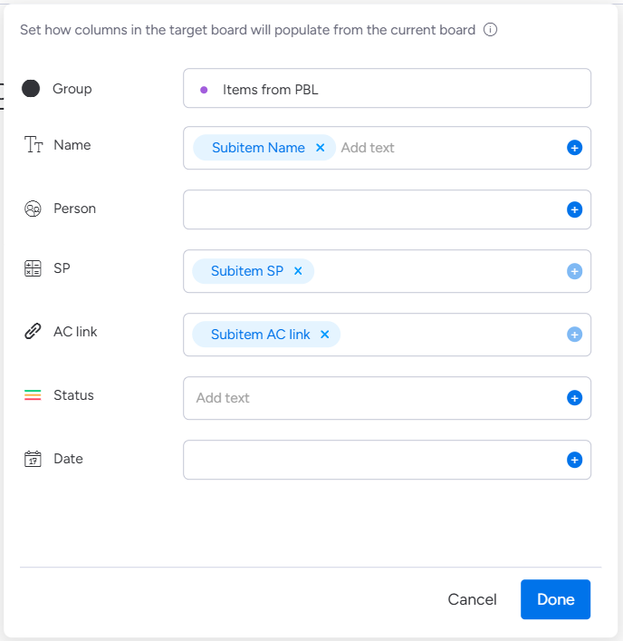
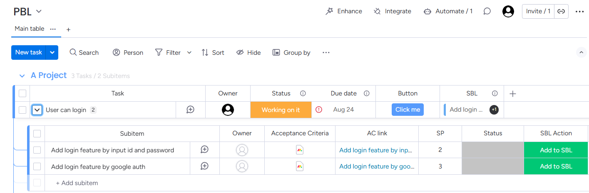
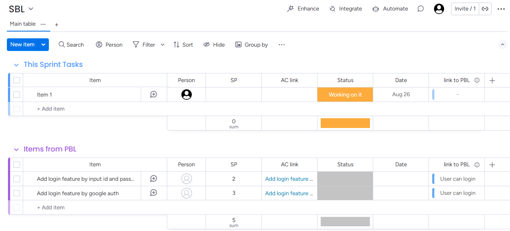

Manual copying of items from Product Backlog (PBL) to Sprint Backlog (SBL) boards during sprint planning creates inefficiencies and potential for errors. This guide demonstrates how to automate this process using monday.com's built-in automation features.

This implementation eliminates manual copy-paste workflows and reduces sprint planning overhead.

## Solution Overview

This automation leverages monday.com's standard automation features to eliminate manual processes. Using built-in functionality ensures reliability and reduces dependency on external tools.

The implementation involves four key steps:

1. Configure necessary columns on the PBL board
2. Set up corresponding columns on the SBL board
3. Create automation triggers and actions
4. Test and validate the workflow

## PBL Board Configuration

### Required Columns

- **SP**: Story Points (Numbers column type)
- **Acceptance Criteria**: Acceptance criteria documentation (monday doc type)
- **AC link**: Link to acceptance criteria (Link column type)

### Important Limitation

Monday.com's automation cannot directly copy monday doc column types. To work around this limitation, use a Link column to store references to the acceptance criteria documents. This approach maintains traceability while enabling automation compatibility.

The AC link column serves as a bridge, allowing teams to access detailed acceptance criteria from the SBL board.

## SBL Board Configuration

The SBL board requires corresponding columns to receive data from the PBL board automation.

### Required Columns

- **SP**: Story Points (Numbers column type)
- **AC link**: Acceptance Criteria links (Link column type)

### Best Practice

Use identical column names between PBL and SBL boards. This naming consistency simplifies automation configuration and reduces setup errors.

## Automation Configuration

### Trigger Setup

Create a Status column named "SBL Action" on the PBL board with an option "Add to SBL." Configure the automation to trigger when this status changes to "Add to SBL."

This trigger method provides controlled execution, ensuring only explicitly selected items are processed and preventing accidental bulk operations.

### Action Configuration

Configure the automation to create new items in the SBL board with the following data mapping:

- **Item Name**: Copy the subitem name
- **SP**: Transfer Story Points value
- **AC link**: Copy Acceptance Criteria link

This configuration ensures all critical sprint planning information transfers accurately to the SBL board.

## Testing and Validation

### Test Procedure

1. Select a test item on the PBL board and change "SBL Action" to "Add to SBL"

2. Verify that the item appears correctly on the SBL board with all mapped data

## Conclusion

This automation solution transforms a manual, error-prone process into an efficient, one-click operation. The implementation demonstrates how monday.com's standard features can address common workflow challenges without requiring external tools or custom development.

Organizations experiencing similar inefficiencies in their sprint planning process should consider implementing this automation pattern. The solution provides immediate productivity gains while maintaining data integrity and process consistency.

### Scalability Considerations

This automation pattern can be extended to other board combinations and workflow scenarios. Teams should evaluate their manual processes for similar automation opportunities to maximize platform value and operational efficiency.