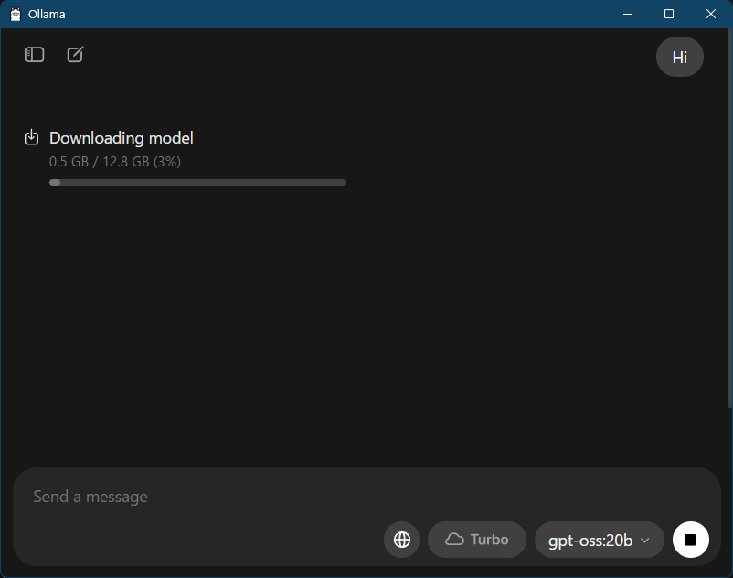
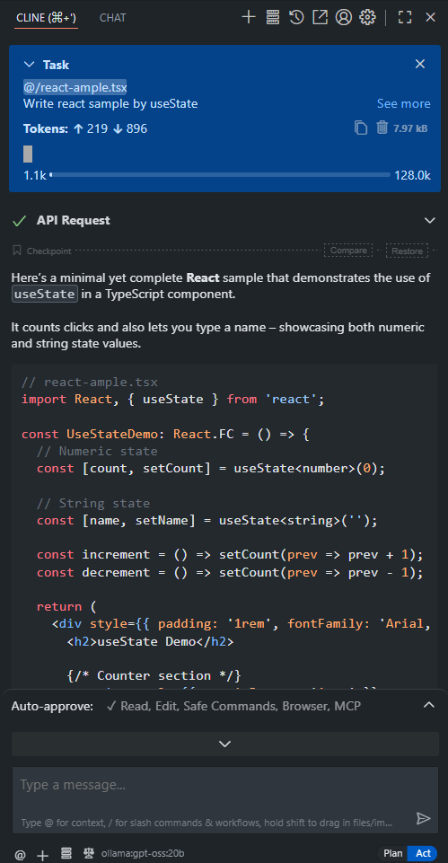

The demand for running LLMs locally has been growing recently. Whether it's for privacy-sensitive projects, development in environments with unstable internet connections, or various other reasons, local LLMs are gaining significant attention.

In this article, I'll walk you through setting up a local LLM development environment on Windows using Ollama and VSCode's Cline extension to run the gpt-oss:20b model. I tested this setup on a PC with 32GB of RAM.

## Prerequisites

The environment I tested includes:

- Windows 11
- 32GB RAM
- Sufficient storage space (several GB needed for model files)
- VSCode already installed

## Installing Ollama

First, let's install Ollama, which will serve as our local LLM runtime environment.

### 1. Download the Installer

Visit the official Ollama website and download the installer by clicking "Download for Windows".

https://ollama.com

### 2. Run the Installation

Execute the downloaded installer and follow the on-screen instructions to complete the installation. No special configuration is needed - the default settings work fine.

## Downloading the gpt-oss:20b Model

Next, let's download the LLM model we'll actually use.

### 1. Launch the Ollama App

Once installation is complete, launch the Ollama application.

### 2. Select and Download the Model

In the app, select "gpt-oss:20b" from the model selection screen. Enter any message and the model download will automatically begin.

Since this is a 20B parameter model, the download will take some time.



### 3. Configure Context Length

After the download completes, go to Settings > Context length and set the Context length to 4k (default value). If you have more memory available, you can adjust this later.

### 4. Restart the System

Restart your PC once to ensure the settings are properly applied.

## Verifying the Installation

Let's verify that Ollama was installed correctly.

Open PowerShell (close and reopen it) and run the following command:

```powershell
ollama --version
```

If a version number is displayed, the installation was successful.

```
ollama version is 0.11.4
```

You should see output similar to this.

## Installing Cline in VSCode

Now let's install the Cline extension in VSCode to set up the LLM integration environment.

### 1. Install the Cline Extension

Launch VSCode and search for "Cline" in the Extensions tab, then install it.

### 2. Configure Cline

After installation, configure Cline with the following settings:

```
API Provider: Ollama
Model: gpt-oss:20b
Model Context Window: 4096
Request Timeout: 300000
```

Details for each setting:

- **API Provider**: Select Ollama
- **Model**: Specify gpt-oss:20b
- **Model Context Window**: Set to 4096 to match Ollama's setting
- **Request Timeout**: Set to 300000ms (5 minutes)

Here is an image of Cline in operation.


## Configuration Tips

### About Context Window Size

The Context Window size needs to match between both Ollama and Cline. We're setting it to 4096 this time, but if your PC has higher specs, you can set it to a larger size.

### About Timeout Settings

Local LLMs tend to respond slower compared to cloud-based APIs. Therefore, I strongly recommend setting the Request Timeout to a longer duration.

## Real-World Usage Experience

### Performance

To be honest, using local gpt-oss:20b with Cline is quite slow. Compared to cloud-based GPT-4 or Claude 3.5 Sonnet, here are the differences:

**Response Speed Comparison**
- Cloud APIs: Several seconds to tens of seconds
- Local gpt-oss:20b: Tens of seconds to several minutes

### Suitable Use Cases

This environment is particularly effective in the following scenarios:

- **Privacy-critical projects**: When you don't want to send code or information externally
- **Unstable internet connections**: Development in offline environments
- **Learning and experimentation**: When you want to understand LLM operations in detail
- **Cost reduction**: Long-term projects where you want to minimize API usage fees

## Conclusion

Setting up a local LLM environment with Ollama and Cline on Windows is easier to achieve than you might think. However, in terms of performance, it's honestly quite slow.

**Advantages**
- Complete privacy protection
- No internet connection required
- No API usage fees
- Ideal for learning and experimentation

**Disadvantages**
- Very slow response times
- Requires large amounts of memory and storage
- High power consumption

While it's challenging to use as a daily replacement for cloud APIs, I think it's a very valuable environment for specific purposes. Particularly for confidential projects or when you want to deeply understand how LLMs work, experience with this environment might be helpful.

If you're interested, I encourage you to give it a try. It's easier to set up than you might think, so it could make for an interesting weekend project.

> **Note**: The content of this article is based on information as of August 2025. Setting methods and behavior may change due to version updates of Ollama and Cline.
